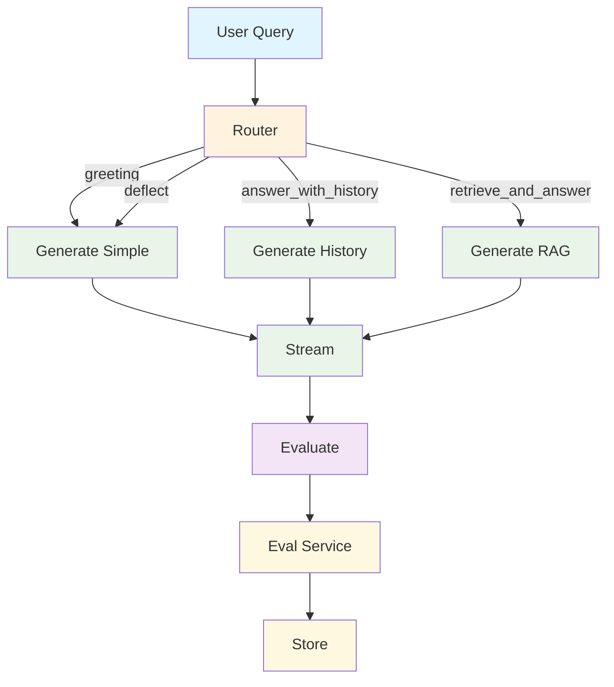

# ChatRaghu Backend

A microservices-based backend for raghu.fyi application, consisting of a main API service and a separate evaluation service.

## Architecture

The application is split into two main services:

1. **Main ChatRaghu Backend** (Port 3000): Handles chat requests, document retrieval, and conversation flow
2. **Evaluation Service** (Port 8001): Processes conversation evaluations and quality metrics

## Conversation Flow Architecture

The main service implements a simplified, adapter-driven graph engine:



### Graph Node Details

- **Router (non-streaming)**: Chooses one of four decisions: `greeting`, `deflect`, `answer_with_history`, or `retrieve_and_answer`.
- **Generate Simple Response (streaming)**: Handles `greeting` and `deflect` outcomes.
- **Generate Answer with History (streaming)**: Answers using conversation history only.
- **Generate Answer with RAG (streaming)**: Retrieves documents and answers with context.

### Edge Map

The routing edges are defined as:

```text
router:
  greeting -> generate_simple_response
  deflect -> generate_simple_response
  answer_with_history -> generate_answer_with_history
  retrieve_and_answer -> generate_answer_with_rag

generate_simple_response -> END
generate_answer_with_history -> END
generate_answer_with_rag -> END
```

## Services

### Main Service (`chatraghu-backend`)
- FastAPI application handling chat requests
- **Graph Engine**: Orchestrates conversation flow through decision nodes
- **Adapters**: Modular components for each graph node (relevance, routing, generation)
- **Document Retrieval**: RAG functionality with context-aware retrieval
- **Message Queue**: Asynchronous evaluation enqueueing
- Authentication and rate limiting

### Evaluation Service (`evaluation-service`)
- Separate FastAPI service for evaluation processing
- **Message Queue Integration**: Receives conversation flows via HTTP from main service
- **Modular Evaluators**: Extensible evaluator architecture in `evals-service/evaluators` package
- **Multiple Evaluations**: Per-graph-node evaluations (relevance, persona, etc.)
- Results storage and metrics
- **Structured LLM Validation**: Using Instructor and Pydantic for hallucination prevention

## Service Communication

### Message Queue System

The main service communicates with the evaluation service using an **asynchronous message queue**:

1. **Queue Manager**: `EvaluationQueueManager` maintains an in-memory `asyncio.Queue`
2. **Background Worker**: Processes evaluation requests in the background
3. **HTTP Communication**: Sends `ConversationFlow` objects to evaluation service via HTTP
4. **Retry Logic**: Handles failures with automatic retries
5. **Graceful Shutdown**: Clean cancellation on service shutdown

**Queue Flow:**
```
Main Service → Queue Manager → Background Worker → HTTP Client → Evaluation Service
```

### API Endpoints

- **Asynchronous Evaluation**: Main service sends evaluation requests to `/evaluate`
- **Health Monitoring**: Regular health checks via `/health`
- **Queue Management**: Internal queue operations for conversation flow processing

## Recent Updates

### Graph Engine Enhancements

**Adapter Architecture**
- **UPDATED**: Simplified to a single non-streaming `router` and three streaming generators
- **UNCHANGED**: Structured validation via Pydantic models for routing and generation
- **UNCHANGED**: Context-aware routing based on LLM decisions

**Conversation Flow**
- **UPDATED**: Decisions consolidated into the `router` node
- **UPDATED**: Generation handled by a single-step streaming node per mode (simple/history/RAG)
- **UNCHANGED**: Comprehensive audit logging with token usage tracking
- **UNCHANGED**: Opik integration for distributed tracing

### Evaluation Service Enhancements

**Structured LLM Validation with Instructor**
- **NEW**: Replaced manual JSON parsing with Instructor-patched OpenAI client
- **NEW**: Added `LLMRelevanceJudgement` Pydantic model for strict response validation
- **NEW**: Eliminated LLM hallucination through structured validation
- **NEW**: Enhanced error handling and logging for evaluation processes

**Message Queue Integration**
- **NEW**: Asynchronous conversation flow processing
- **NEW**: Background worker with graceful shutdown
- **NEW**: HTTP-based communication between services
- **NEW**: Comprehensive error handling and retry logic
